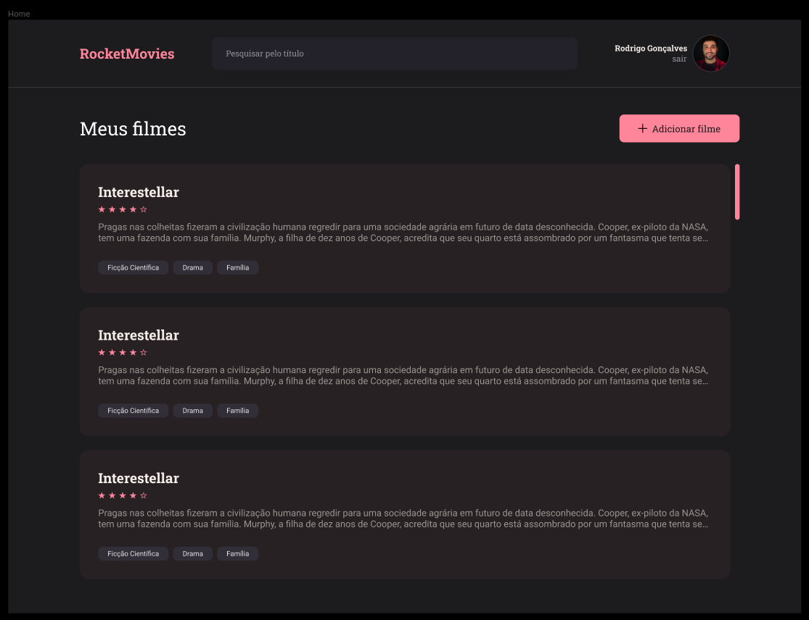

Front-end da aplicação RocketMovie

 

🚀 Tecnologias
Esse projeto foi desenvolvido com as seguintes tecnologias:

Vite;
React JS;
componentes estilizados;
React-roteador-dom;

Você pode visualizar o layout do projeto através do DESSE [LINK](https://www.figma.com/file/ey3CSOiM3l0QIZMPTb4ZEi/RocketMovies-(Copy)?node-id=0%3A1&mode=dev) . É necessário ter conta no Figma . 

